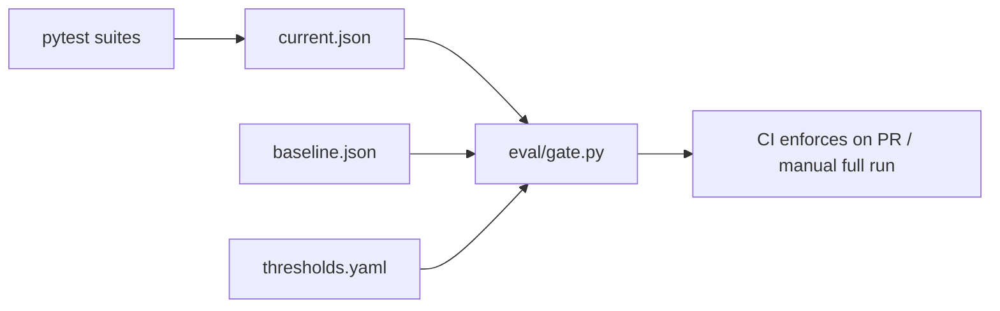

# AI Compliance QA Lab — Cursor Agent Guide

This repo is a **hands-on AI QA laboratory**: a production-style RAG + agent app over the EU AI Act, with a full eval pyramid and CI gate. Use this file as the project brief when working here.

## Two modes

| Mode | When | How to invoke |
|------|------|---------------|
| **Maintainer** | Fix CI, upgrade deps, tune thresholds, promote baseline, add tests | Say: *"Use repo-maintainer skill"* or `@.cursor/skills/repo-maintainer/SKILL.md` |
| **Tutor** | Learn AI QA, interview prep, understand failing tests | Say: *"Use ai-qa-tutor skill"* or `@.cursor/skills/ai-qa-tutor/SKILL.md` |
| **Stack review** | Audit repo vs senior AI QA market expectations, practice readiness | Say: *"Use ai-qa-stack-review skill"* or `@.cursor/skills/ai-qa-stack-review/SKILL.md` |
| **Lead AI/ML** | Architecture, system design, MLOps, Staff/Lead interview prep, RFCs | Say: *"Use lead-ai-ml-engineer skill"* or `@.cursor/skills/lead-ai-ml-engineer/SKILL.md` |

Default to **maintainer** for code changes; default to **tutor** when the user is learning or asks "why" / "explain" / "quiz me"; use **stack review** when assessing portfolio or "is this lab enough for senior AI QA?"; use **Lead AI/ML** for architecture, scaling, production evolution, or Staff-level system design interviews.

## Key commands

```bash
make setup          # venv + pip install + .env from example
make ingest         # requires corpus/eu_ai_act.pdf (not committed)
make unit           # fast tests, no API keys (~5s) — run on every change
make eval-fast      # unit + adversarial + budget + gate (cheaper)
make eval-full      # full eval suite + gate
make gate           # compare eval/reports/current.json vs baseline.json
make promote-baseline   # copy current → baseline (only after a good full run)
make serve          # Streamlit UI (RAG + Agent + Eval tabs)
make api            # FastAPI on :8000
make garak-redteam  # optional automated red-team scan (garak)
make promptfoo-eval # prompt v1 vs v2 regression
```

## Repository map

| Path | Purpose |
|------|---------|
| `app/` | RAG core, `retrieval/` (hybrid + rerank), ReAct agent, providers, observability, Streamlit UI |
| `eval/` | Eval harness, gate, golden datasets, integration eval tests |
| `tests/` | Fast unit tests — no API keys |
| `promptfoo/` | Config-driven prompt regression |
| `docs/` | Architecture, eval strategy, study guide, agent QA |
| `docs/ALLIANZ_SUPPLEMENT.md` | LangSmith, ISTQB, A/B, garak, spec-driven QA (interview gaps) |
| `.github/workflows/eval-gate.yml` | CI: unit (PR/push) → eval-fast (skips without keys) → eval-full manual only |

## Eval architecture (short)



1. **Tests measure** → write `eval/reports/current.json` via `eval/reporting.py`
2. **Gate compares** → `eval/gate.py` checks floors (`eval/thresholds.yaml`) + regression vs `eval/reports/baseline.json`
3. **CI enforces** → PRs run `unit` + `eval-fast` (skips API tests without secrets); full eval via **Actions → Eval Gate → Run workflow**

## Safety

- Never commit `.env`, API keys, or `corpus/*.pdf`
- `eval/reports/current.json` and `gate-summary.md` are gitignored (generated artifacts)
- `eval/reports/baseline.json` **is** committed — treat promotion as a deliberate release decision
- Pin `langchain` to 0.3.x (see `pyproject.toml` comment) — ragas breaks on 0.4+

## Study docs (for tutor mode)

- `docs/ONBOARDING_7_DAYS.md` — 7-day onboarding schedule (start here)
- `docs/DAY_02_RAGAS.md` — Day 2 detailed workbook (RAGAS + golden datasets)
- `docs/ALLIANZ_SUPPLEMENT.md` — interview gaps (LangSmith, ISTQB, A/B, garak)
- `docs/STUDY_GUIDE.md` — exercises by module
- `docs/STUDY_PLAN.md` — 4-week schedule
- `docs/EVAL_STRATEGY.md` — test pyramid, OWASP mapping, gate logic
- `docs/AGENT_QA.md` — agent trajectory testing strategy
- `docs/ARCHITECTURE.md` — system design

## App agent vs Cursor agent

- `app/agent/` — the **Python ReAct agent** you test (tools: search, lookup, risk tier, fine calc)
- `.cursor/skills/` — **Cursor playbooks** for maintaining and learning this repo

Do not confuse them when editing or explaining code.
