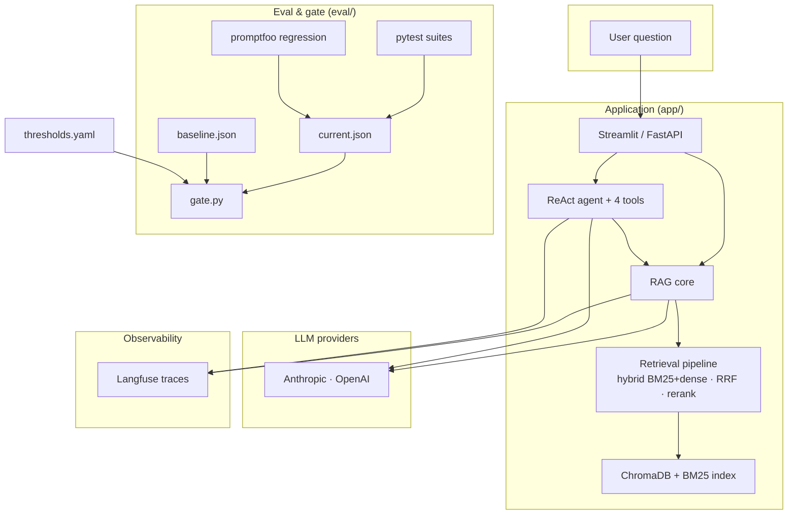
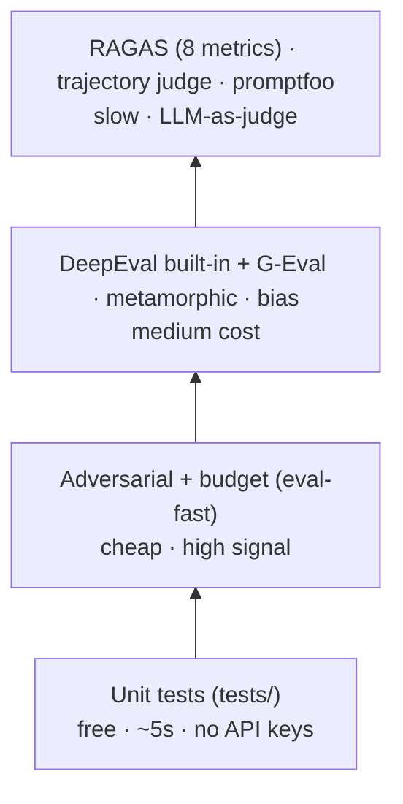
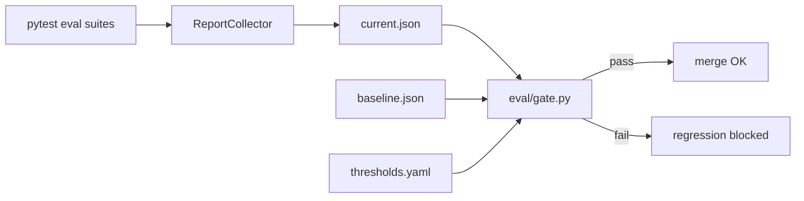
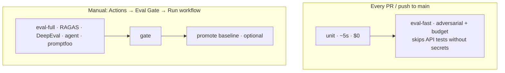

# AI Compliance QA Lab

A hands-on laboratory for becoming a strong **AI QA engineer**: production-style RAG + agent app over the **EU AI Act**, with a full eval pyramid and CI gate.

> **Study-first design:** every layer maps to a skill interviewers test in 2026. See [`docs/STUDY_GUIDE.md`](docs/STUDY_GUIDE.md) for exercises.

## System overview



## Eval pyramid



Run `make unit` on every change; run `make eval-full` before merging eval-related work. Details: [`docs/EVAL_STRATEGY.md`](docs/EVAL_STRATEGY.md).

## What you'll learn here

| Skill | Where in repo |
|-------|----------------|
| Advanced retrieval (hybrid + rerank) | `app/retrieval/` | `docs/ARCHITECTURE.md` |
| RAG quality metrics (RAGAS) | `eval/test_ragas.py` |
| Custom LLM-as-judge metrics | `eval/test_deepeval.py`, `eval/agent/test_deepeval_agent.py` |
| Prompt regression (promptfoo) | `eval/test_promptfoo.py`, `promptfoo/` |
| Regression gates vs baselines | `eval/gate.py`, `eval/reports/baseline.json` |
| Adversarial / OWASP testing | `eval/test_adversarial.py`, `eval/agent/test_adversarial.py` |
| Metamorphic + fairness testing | `eval/test_metamorphic.py`, `eval/test_bias.py` |
| Agent trajectory QA | `eval/agent/`, `docs/AGENT_QA.md` |
| Observability for drift debug | `app/observability.py` + Langfuse |
| Fast unit tests (no API) | `tests/` |
| Poisoned retrieval (LLM08) | `tests/test_rag_security.py` |

## Stack

FastAPI · Streamlit · ChromaDB · Anthropic + OpenAI · RAGAS · DeepEval · promptfoo · Langfuse · GitHub Actions

## Quick start

```bash
git clone <repo>
cd ai-compliance-qa-lab
make setup                    # pip install + copy .env.example
# Add API keys to .env

# Download EU AI Act PDF → corpus/eu_ai_act.pdf
# https://eur-lex.europa.eu/legal-content/EN/TXT/PDF/?uri=OJ:L_202401689
make ingest

make unit                     # fast tests, no API keys (~5s)
make serve                    # Streamlit: RAG + Agent + Eval tabs
make api                      # FastAPI on :8000

# Optional observability
docker compose up -d          # self-hosted Langfuse on :3000
# OR use Langfuse Cloud — set LANGFUSE_* in .env
```

## Eval commands

```bash
make eval-fast    # unit + adversarial + budget + gate (cheaper)
make eval-full    # entire eval suite + gate
make gate         # compare eval/reports/current.json vs baseline
make promote-baseline   # after a good main run — updates baseline.json
```

## Eval gate logic



`eval/gate.py` compares `eval/reports/current.json` against `eval/reports/baseline.json`:

- **Absolute floors** — from `eval/thresholds.yaml` (faithfulness ≥ 0.80, etc.)
- **Regression vs baseline** — faithfulness/relevance drop > 5pp fails
- **Latency regression** — p95 increase > 30% fails
- **Adversarial** — if baseline had passing adversarial suites, current must too

Promote baseline only after a green full run: `make promote-baseline` (or CI workflow checkbox). See [`docs/ARCHITECTURE.md`](docs/ARCHITECTURE.md).

## CI pipeline



| Job | Trigger | Cost |
|-----|---------|------|
| `unit` | PR + push | $0 |
| `eval-fast` | PR + push (skips API tests without secrets) | ~$0–0.30 |
| `eval-full` | workflow_dispatch only | ~$1.50–2.50 |

## Repository layout

```
app/             RAG core, retrieval pipeline, agent, observability, UI
eval/            Eval harness, gate, golden datasets, all test suites
tests/           Fast unit tests (no API keys)
promptfoo/       Config-driven prompt regression
corpus/          EU AI Act PDF (not committed — download manually)
scripts/         Ingestion
docs/            Architecture, eval strategy, study guide
.github/         CI: unit → eval-fast (PR); eval-full (manual)
```

## Study path

1. **Week 1** — `make ingest`, `make unit`, get RAGAS green → [`docs/STUDY_GUIDE.md`](docs/STUDY_GUIDE.md)
2. **Week 2** — Langfuse traces, adversarial suite, calibrate thresholds
3. **Week 3** — Agent eval layers, trajectory judge
4. **Week 4** — CI gate, portfolio demo, mock interviews

## License

MIT
