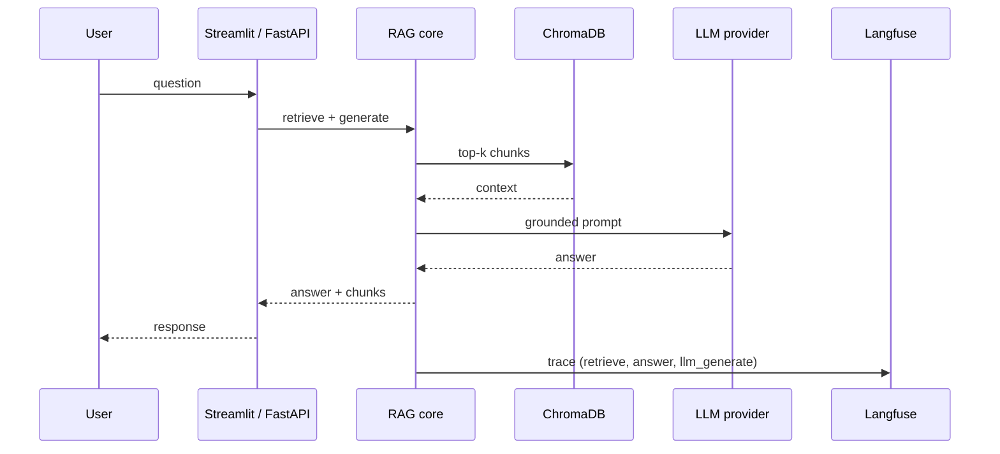
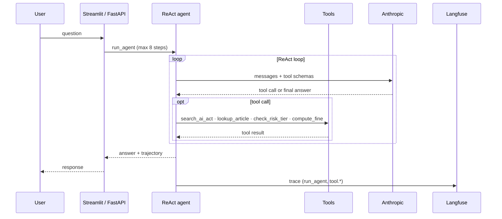
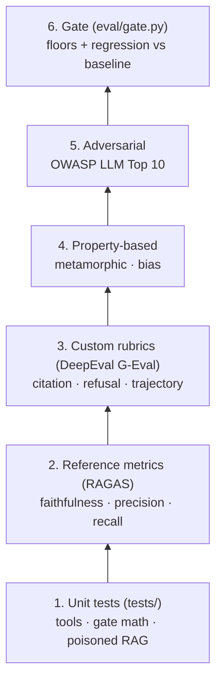
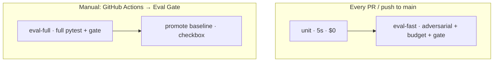
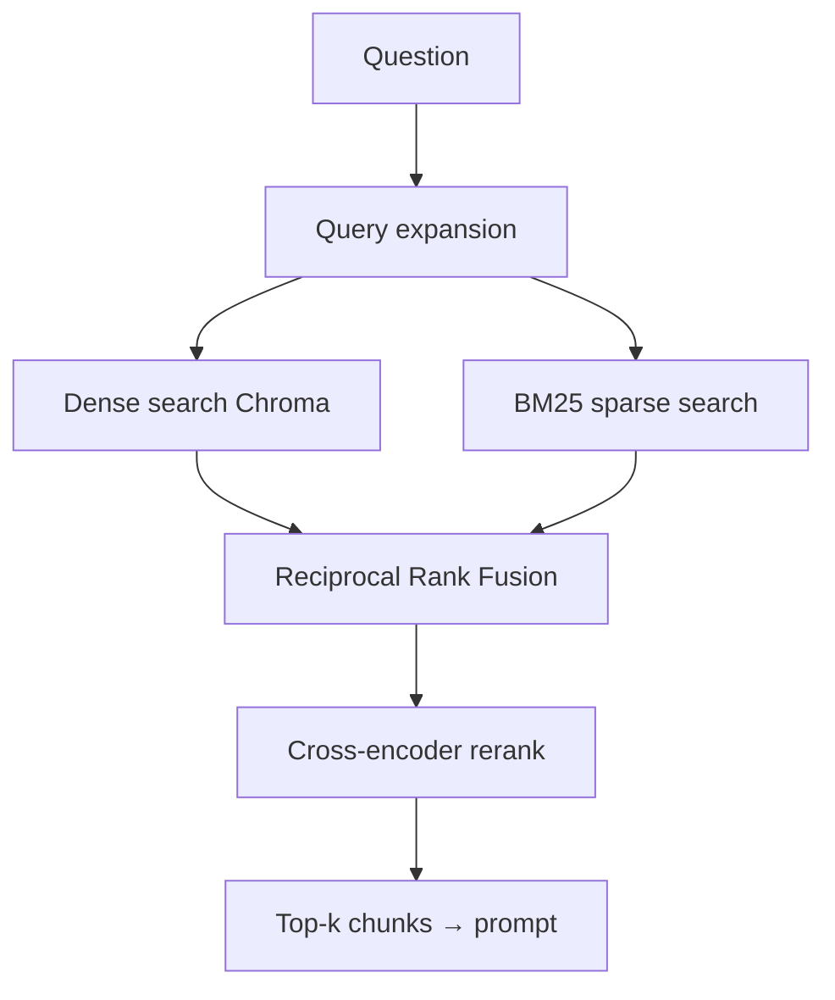

# Architecture

## Goals

1. Demonstrate end-to-end AI QA — from app code to CI gate.
2. Provide a hands-on practice surface for every major AI QA concern.
3. Stay cheap (under €30/month API spend) and reproducible.

## High-level flow



## Agent flow



## Component decisions

| Choice | Rationale | Alternative considered |
|---|---|---|
| ChromaDB | Local, no infra, persistent | Pinecone (cost), pgvector (overhead) |
| **Advanced retrieval** (`app/retrieval/`) | Hybrid BM25 + dense, RRF fusion, cross-encoder rerank, query expansion | Basic vector-only (still available via `RAG_RETRIEVAL_MODE=basic`) |
| RecursiveCharacterTextSplitter with `\nArticle ` separator | Preserves legal structure | Semantic chunking (slower, marginal gain) |
| OpenAI text-embedding-3-small | Cheap, strong recall | BGE local (avoids API but adds infra) |
| Two providers wired from day 1 | Provider diversity is an interview signal | Single provider (less work but weaker story) |
| Claude Haiku for eval, Sonnet for prod | Cost control | Always-Sonnet (3-5x cost) |
| RAGAS + DeepEval + promptfoo | Each covers a different angle | Pick one (less interview surface area) |
| Trajectory cache in eval | Cuts agent CI cost ~4× | Re-run agent per assertion (wasteful) |

## Eval strategy

See `docs/EVAL_STRATEGY.md` for the full pyramid. Summary:



1. **Unit tests** (`tests/`) — tools, gate math, poisoned retrieval. No API keys.
2. **Reference metrics** (RAGAS) — faithfulness, context precision/recall, answer relevance.
3. **Custom rubrics** (DeepEval G-Eval) — citation, refusal, trajectory quality.
4. **Property-based** — paraphrase + demographic invariance via embeddings.
5. **Adversarial** — OWASP categories + agent-specific attacks.
6. **Gate** (`eval/gate.py`) — absolute floors + regression vs `eval/reports/baseline.json`.

## CI pipeline



Fast PR feedback on unit tests; `eval-fast` runs adversarial + budget when API secrets are set. Full eval (RAGAS, DeepEval, agent) is **workflow_dispatch only** — blocks regression only when you run it.

## Handling non-determinism

- **Embedding similarity** for semantic equivalence
- **LLM-as-judge with calibrated rubric** for nuanced criteria
- **Keyword markers** only for binary properties (refusals)
- **Trajectory caching** (`EVAL_USE_CACHE=1`) for agent eval stability

## Observability

`app/observability.py` wraps RAG and agent calls in Langfuse traces when `LANGFUSE_*` keys are set. No-op without keys (unit tests, offline dev).

Traced spans: `retrieve`, `answer`, `llm_generate`, `run_agent`, `tool.*`

## Cost model

| Command | Approx cost |
|---------|-------------|
| `make unit` | $0 |
| `make eval-fast` | $0.10–0.30 |
| `make eval-full` | $1.50–2.50 |

## Repository map

```
app/
  rag.py              RAG retrieve + generate
  retrieval/          Hybrid BM25 + vector, RRF, cross-encoder rerank
  observability.py    Langfuse traces (no-op without keys)
  agent/              ReAct loop + 4 tools
  providers.py        Anthropic / OpenAI abstraction
  streamlit_ui.py     RAG + Agent + Eval scorecard tabs
eval/
  gate.py             Baseline comparison gate
  reporting.py        Metric collection → current.json
  thresholds.yaml     Floors + gate tolerances
  conftest.py         Agent trajectory cache
tests/                Fast unit tests
```

## Advanced retrieval (Phase 2)

When `RAG_RETRIEVAL_MODE=advanced` (default):



Set `RAG_RETRIEVAL_MODE=basic` to restore naive vector-only retrieval.

## What's intentionally out of scope

- Fine-tuning
- Managed vector DB (Pinecone / pgvector HA)
- Multi-modal
- Multi-agent orchestration
- Tool side effects (email, DB writes) — read-only tools only
