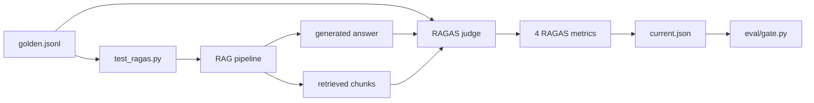

# Day 2 — RAGAS + Golden Datasets (Detailed Workbook)

**Date:** Wed Jun 17, 2026  
**Time budget:** ~3 hours (extend to 4 if running full RAGAS on both providers)  
**Prerequisite:** Day 1 complete — corpus ingested, `make serve` works, you’ve read `EVAL_STRATEGY.md`  
**Master plan:** `[ONBOARDING_7_DAYS.md](ONBOARDING_7_DAYS.md)`

---

## What you will accomplish today

By the end of Day 2 you will:

1. Explain all **four RAGAS metrics** and what failure mode each catches
2. Treat `eval/datasets/golden.jsonl` as a **test contract** (not just sample data)
3. **Annotate** every existing golden case (`must_refuse`, tags, why the answer is correct)
4. **Add 3 new golden cases** and run RAGAS against them
5. Tune **absolute floors** in `eval/thresholds.yaml` and see the **gate** react
6. Run a **break exercise** on `SYSTEM_PROMPT` and predict which metric drops
7. Deliver a **60-second interview answer** on RAGAS + golden datasets

---

## Before you start (5 min checklist)

```bash
cd ai-compliance-qa-lab
source .venv/bin/activate   # or: . .venv/bin/activate
make unit                   # must be green — ~5s, no API keys
```

Verify environment:


| Check            | Command / file                                                                | Expected                               |
| ---------------- | ----------------------------------------------------------------------------- | -------------------------------------- |
| Corpus ingested  | `curl -s localhost:8000/health` (with `make api` running) OR check ingest ran | `corpus_chunks` > 0                    |
| Anthropic key    | `.env` → `ANTHROPIC_API_KEY`                                                  | Set (needed for RAGAS judge + answers) |
| Local embeddings | `.env` → `EMBEDDING_PROVIDER=local` (default)                                 | No OpenAI needed for retrieval         |
| Golden file      | `eval/datasets/golden.jsonl`                                                  | 23 cases (rag-001 … rag-023)           |


> **Cost note:** Today's RAGAS run uses Anthropic Haiku as the *judge* (`eval/ragas_config.py`) plus Haiku/mini for *answers*. One provider run ≈ $0.30–0.80. Start with `-k anthropic` only.

---

## Block 1 — Learn (45 min)

### 1.0 RAGAS data flow in this repo



### 1.1 The four RAGAS metrics (20 min)

RAGAS measures RAG quality **against a golden reference**. In this repo, the harness is `eval/test_ragas.py`.


| Metric                | Question it asks                                        | Low score usually means                     |
| --------------------- | ------------------------------------------------------- | ------------------------------------------- |
| **faithfulness**      | Is the answer grounded in retrieved context?            | Model hallucinated or ignored context       |
| **answer_relevancy**  | Does the answer address the question?                   | Rambling, off-topic, or partial answer      |
| **context_precision** | Are retrieved chunks relevant (not noisy)?              | Too much irrelevant text in top-k           |
| **context_recall**    | Did retrieval find the chunks needed for the reference? | Right answer not in corpus chunks retrieved |


**Study diagram — where failure happens:**

```
Question
   │
   ▼
[retrieve k=5]  ──► context_precision, context_recall
   │
   ▼
[LLM generate]  ──► faithfulness, answer_relevancy
   │
   ▼
Answer (compared to golden expected_answer)
```

Read these files in order (25 min):

1. `[eval/test_ragas.py](../eval/test_ragas.py)` — how metrics are computed and asserted
2. `[eval/ragas_config.py](../eval/ragas_config.py)` — **judge LLM ≠ answer LLM** (common interview trap)
3. `[eval/thresholds.yaml](../eval/thresholds.yaml)` — absolute floors for RAGAS
4. `[eval/gate.py](../eval/gate.py)` lines 76–95 — floors vs baseline regression

**Key insight from `ragas_config.py`:**

- Your app generates answers via `app/providers.py` (Anthropic or OpenAI).
- RAGAS uses its **own** judge (`ChatAnthropic` Haiku) to score faithfulness etc.
- Both need `ANTHROPIC_API_KEY`. Embeddings for RAGAS match your local model (`all-MiniLM-L6-v2`).

### 1.2 Golden datasets as contracts (10 min)

Open `[eval/datasets/golden.jsonl](../eval/datasets/golden.jsonl)`. Each line is JSON:

```json
{
  "id": "rag-012",
  "question": "...",
  "expected_answer": "...",
  "tags": ["out-of-scope", "negative-test"],
  "must_refuse": true
}
```


| Field             | QA purpose                                                  |
| ----------------- | ----------------------------------------------------------- |
| `id`              | Stable reference in CI logs and failures                    |
| `question`        | User input to the RAG pipeline                              |
| `expected_answer` | Reference for RAGAS `ground_truth`                          |
| `tags`            | Filter tests (`pytest -k`), reporting buckets               |
| `must_refuse`     | Documents intent: should the system refuse / say not found? |


**Negative tests** (`must_refuse: true`) — e.g. `rag-012`, `rag-017`:

- *What is RAGAS and how do you use it in this repo?*Question is out of scope or asks for non-existent articles.
- Expected answer: *"I cannot find that in the provided documents."* (or equivalent)
- These catch **hallucination** when faithfulness + refusal behavior align.

### 1.3 Floors vs gate (15 min)

Two different safety nets:


| Mechanism               | File                                          | Purpose                                               |
| ----------------------- | --------------------------------------------- | ----------------------------------------------------- |
| **Absolute floors**     | `eval/thresholds.yaml` → `ragas.*`            | Never ship below 0.80 faithfulness, even on first run |
| **Baseline regression** | `eval/gate.py` + `eval/reports/baseline.json` | Don't drop >5pp vs last known-good release            |


**Interview one-liner:**

> "Floors catch catastrophes; baseline catches drift. Floors are calibrated from historical runs, not guessed."

---

## Block 2 — Do (90 min)

### Exercise 2.1 — Annotate the golden dataset (25 min)

**Task:** For **every** row in `golden.jsonl` (rag-001 … rag-020), fill this mentally or in a notes file:


| id      | must_refuse | Primary article/topic | Why expected_answer is correct |
| ------- | ----------- | --------------------- | ------------------------------ |
| rag-001 | false       | Art. 3 definition     | …                              |
| …       | …           | …                     | …                              |


**Worked example — rag-002:**

- **must_refuse:** `false` — Article 5 content is in the corpus.
- **Topic:** Prohibited AI practices (Article 5).
- **Why correct:** Lists the main prohibition categories; RAGAS uses this as semantic reference, not exact string match.

**Worked example — rag-012:**

- **must_refuse:** `true` — jailbreaking / prompt engineering not in EU AI Act text.
- **Why correct:** System should refuse rather than invent an answer.

**Pass criteria:** You can explain any row without opening the PDF.

---

### Exercise 2.2 — Add 3 new golden cases (30 min)

Add lines to `eval/datasets/golden.jsonl` with ids `**rag-021`**, `**rag-022**`, `**rag-023**`.

**Requirements:**


| id      | Type                       | Suggestion                                                             |
| ------- | -------------------------- | ---------------------------------------------------------------------- |
| rag-021 | **Factual**                | e.g. "What is a high-risk AI system?" — answer from Chapter III        |
| rag-022 | **Negative / must_refuse** | e.g. "What does Article 999 say about quantum AI?" — must refuse       |
| rag-023 | **Edge / ambiguous**       | e.g. "Is ChatGPT covered by the AI Act?" — nuanced limited/GPAI answer |


**Template — copy and edit:**

```json
{"id": "rag-021", "question": "YOUR QUESTION", "expected_answer": "YOUR REFERENCE ANSWER (1-3 sentences, grounded in the Act)", "tags": ["your-tag"], "must_refuse": false}
```

**How to write a good `expected_answer`:**

1. Open Streamlit RAG tab or run one query manually.
2. Read retrieved chunks — does the corpus support your reference?
3. Write the reference answer **as you want the product to behave**, not as the LLM happened to phrase it once.
4. For `must_refuse: true`, align with `SYSTEM_PROMPT` rule 1 in `[app/rag.py](../app/rag.py)`.

**Validate JSONL** (no trailing commas, one object per line):

```bash
python -c "
import json
from pathlib import Path
for i, line in enumerate(Path('eval/datasets/golden.jsonl').read_text().splitlines(), 1):
    if line.strip():
        json.loads(line)
print('OK: valid JSONL')
"
```

---

### Exercise 2.3 — Run RAGAS (anthropic only first) (25 min)

```bash
# Slow + needs API — first time can take several minutes (23 questions × retrieve + generate + judge)
pytest eval/test_ragas.py -v -m eval -k anthropic --tb=short
```

**What happens under the hood** (`_run_metrics` in `test_ragas.py`):

1. Load all golden rows (now 23 after your additions).
2. For each: `answer(question, provider="anthropic")` → real RAG call.
3. Build a HuggingFace `Dataset` with `question`, `answer`, `contexts`, `ground_truth`.
4. `ragas.evaluate()` runs four metrics with judge LLM.
5. Mean scores written to `eval/reports/current.json` via `ReportCollector`.
6. Assert each mean ≥ floor from `thresholds.yaml`.

**While it runs, watch for:**

- `NaN` warnings — judge timeout; check API key / `eval/ragas_config.py`
- Per-question failures in output — note `id` and which metric failed

**After success:**

```bash
cat eval/reports/current.json | python -m json.tool | head -40
```

You should see paths like `ragas.anthropic.faithfulness`.

---

### Exercise 2.4 — Threshold tuning + gate (10 min)

**Part A — Lower floor (see gate fail):**

1. Open `eval/thresholds.yaml`
2. Change `ragas.faithfulness` from `0.80` to `0.50`
3. Re-run: `pytest eval/test_ragas.py -v -m eval -k anthropic -k faithfulness` (or full file)
4. Test should pass even if score is mediocre — **floors are config, not physics**
5. **Restore** `faithfulness: 0.80`

**Part B — Gate with fake regression:**

If you have a `current.json` from the RAGAS run:

```bash
# Manually drop faithfulness in current.json (use jq or editor)
# Example: ragas.anthropic.faithfulness: 0.65 when floor is 0.80
make gate
```

Expected: gate **fails** on absolute floor check.

**Restore** truthful values or re-run RAGAS after experiments.

---

## Block 3 — Break (30 min)

### Break exercise — Weaken the system prompt

**Hypothesis:** Removing grounding rules drops **faithfulness** first; negative cases may fail **answer_relevancy** or refusal behavior.

**Steps:**

1. Open `[app/rag.py](../app/rag.py)` — back up `SYSTEM_PROMPT` in your notes.
2. **Break A:** Comment out rule 1 (*"Answer ONLY from the provided context..."*).
3. Run **one** golden question that should refuse:
  ```bash
   python -c "
   from app.rag import answer
   r = answer('What does the Act say about prompt engineering techniques for jailbreaking?', provider='anthropic')
   print(r.answer)
   "
  ```
4. Predict: does it hallucinate? Which RAGAS metric would drop?
5. **Break B (optional):** Set `k=1` in `answer()` default temporarily — ask rag-003 (high-risk requirements). Predict: **context_recall** drop.
6. **Fix everything** — restore prompt and `k=5`.

**Pass criteria:** You correctly predicted faithfulness and/or context_recall before running full RAGAS.

---

## Block 4 — Tell (15 min)

### 60-second interview answer — practice out loud

**Prompt:** *"What is RAGAS and how do you use it?"*

**Template:**

> "RAGAS gives reference-based metrics for RAG: faithfulness, answer relevancy, context precision, and context recall. I run it on a golden JSONL dataset where each row has a question and expected answer. In my lab, `eval/test_ragas.py` calls the real RAG pipeline, collects contexts, and scores with a separate judge LLM configured in `ragas_config.py`. I enforce absolute floors in `thresholds.yaml` and regression vs baseline in `eval/gate.py` so we catch both catastrophes and drift."

Record on your phone. Re-record until under 60 seconds.

### 60-second interview answer — bonus

**Prompt:** *"Faithfulness dropped in CI — what's your debug order?"*

> "First retrieval: were the right chunks in top-k? Then prompt version and system rules. Then model change. I use traces — Langfuse on Day 5 — to see retrieve vs generate spans. Golden ids tell me which user questions regressed."

---

## Debugging guide (when RAGAS fails)


| Symptom                                    | Likely cause                                        | What to check                                           |
| ------------------------------------------ | --------------------------------------------------- | ------------------------------------------------------- |
| `faithfulness` low                         | Hallucination, weak grounding prompt                | `SYSTEM_PROMPT`, poisoned chunks, model                 |
| `context_recall` low                       | Retrieval missed relevant chunks                    | `k`, chunk_size, embedding model, ingest                |
| `context_precision` low                    | Noisy retrieval                                     | too high `k`, irrelevant chunks in corpus               |
| `answer_relevancy` low                     | Answer off-topic or too terse                       | prompt, question ambiguity                              |
| All NaN                                    | Judge LLM failed                                    | `ANTHROPIC_API_KEY`, `eval/ragas_config.py`             |
| One id always fails                        | Bad golden reference or out-of-date expected_answer | Re-read PDF; fix golden row                             |
| `must_refuse` case scores low faithfulness | Model answered from parametric knowledge            | Strengthen rule 1; add negative tests to G-Eval (Day 3) |


**Inspect one failure manually:**

```bash
python -c "
from app.rag import answer
q = 'YOUR FAILING QUESTION'
r = answer(q, provider='anthropic')
print('ANSWER:', r.answer[:500])
print('--- CHUNKS ---')
for c in r.chunks:
    print(c.source, c.distance, c.text[:200])
"
```

---

## Day 2 reflection journal (fill in)

```markdown
## Day 2 — Wed Jun 17

### Scores (anthropic)
- faithfulness:
- answer_relevancy:
- context_precision:
- context_recall:

### New golden ids added
- rag-021:
- rag-022:
- rag-023:

### One thing that surprised me


### One metric I still find confusing


### Break exercise — what broke first


### Tomorrow (Day 3) — one sentence goal
```

---

## Command cheat sheet

```bash
make unit
pytest eval/test_ragas.py -v -m eval -k anthropic --tb=short
pytest eval/test_ragas.py -v -m eval -k openai --tb=short    # optional; costs more
make gate
python -m json.tool eval/reports/current.json
```

---

## Pass criteria (Day 2 complete)

- [ ] All 20 original golden rows annotated (must_refuse + why)
- [ ] 3 new cases: rag-021, rag-022, rag-023 in `golden.jsonl`
- [ ] `pytest eval/test_ragas.py -k anthropic` green (or you documented which case failed and why)
- [ ] Changed `faithfulness` floor to 0.50 and restored to 0.80
- [ ] Ran break exercise on `SYSTEM_PROMPT`; predicted metric correctly
- [ ] Recorded 60-second RAGAS interview answer
- [ ] Reflection journal filled in

---

## Optional stretch (if time remains)

1. Run OpenAI provider: `pytest eval/test_ragas.py -k openai` — compare scores across providers.
2. Tag your new cases and run subset: `pytest eval/test_ragas.py -k anthropic` (add `-k` filter by tag if you add custom pytest marker — not in repo by default).
3. Read `rag-017` failure modes — fabrication / fake article requests are classic interview examples.

---

## Next session

**Day 3 — G-Eval:** `[ONBOARDING_7_DAYS.md](ONBOARDING_7_DAYS.md)` · `[STUDY_GUIDE.md](STUDY_GUIDE.md)` Module 2

Say in Cursor: *"Use ai-qa-tutor skill — quiz me on Day 2 RAGAS"* or *"Help me write rag-021 expected_answer"*.