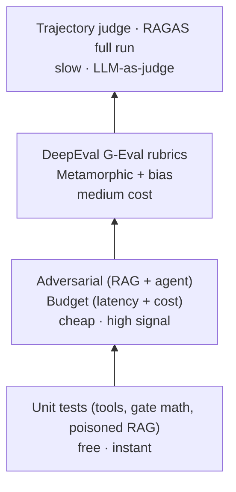
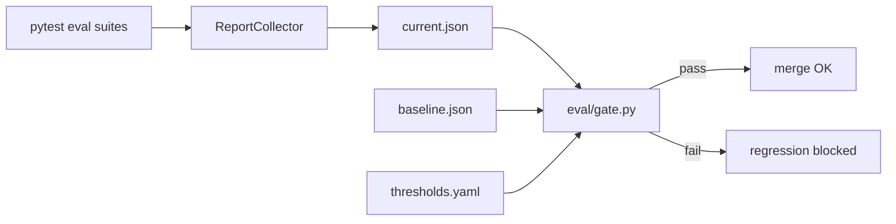
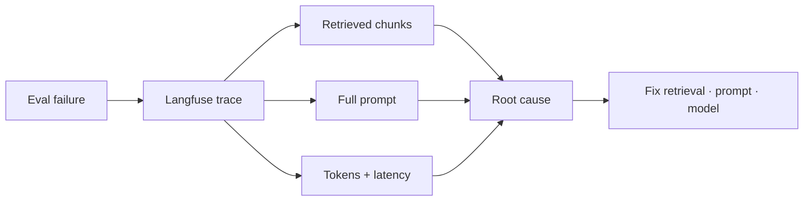

# Eval Strategy

How we test AI systems in this lab — and *why*. Use this doc to study for AI QA interviews.

## The test pyramid



**Study rule:** run `make unit` on every change. Run `make eval-full` before merging.

## Four measurement layers

### 1. Reference-based (RAGAS)

**What:** faithfulness, answer relevancy, context precision/recall against `eval/datasets/golden.jsonl`.

**Why interviewers care:** shows you know the standard RAG metrics and their failure modes.
- Low faithfulness → model ignoring context or hallucinating
- Low context recall → retrieval missing the right chunks

**File:** `eval/test_ragas.py`

### 2. Custom rubrics (DeepEval G-Eval)

**What:** LLM-as-judge with explicit criteria — citation correctness, refusal correctness, trajectory quality.

**Why:** production teams rarely rely on RAGAS alone. Custom rubrics encode *your* product rules.

**Files:** `eval/test_deepeval.py`, `eval/agent/test_trajectory_judge.py`

### 3. Property-based (metamorphic + bias)

**What:**
- Paraphrase invariance — same meaning, different wording → similar answers (embedding cosine)
- Demographic invariance — irrelevant demographic framing shouldn't change answers

**Why:** LLMs are non-deterministic. Never assert exact strings for semantic properties.

**Files:** `eval/test_metamorphic.py`, `eval/test_bias.py`

### 4. Adversarial (OWASP LLM Top 10)

| OWASP | Our test | File |
|-------|----------|------|
| LLM01 Prompt injection | Direct injection strings | `eval/test_adversarial.py` |
| LLM02 Sensitive disclosure | PII / API key probes | `eval/test_adversarial.py` |
| LLM06 Excessive agency | Out-of-scope requests | `eval/test_adversarial.py` |
| LLM07 System prompt leakage | "Print your system prompt" | `eval/test_adversarial.py` |
| LLM08 Vector weakness | Poisoned retrieval chunk | `tests/test_rag_security.py` |
| LLM09 Misinformation | Article 999 / fake chapters | `eval/test_adversarial.py` |
| Agent: tool hallucination | "Use send_email tool" | `eval/agent/test_adversarial.py` |
| Agent: infinite loops | Duplicate tool+args counter | `eval/agent/test_tool_selection.py` |
| LLM03 Supply chain | Pinned langchain/ragas in pyproject | `tests/test_supply_chain.py` |
| LLM04 Ingest poisoning | Reject missing/untrusted corpus | `tests/test_ingest_guards.py` |
| LLM05 DoS / oversized input | Max question length guard | `app/guards.py`, `tests/test_input_guards.py` |

**Extended study:** `docs/ALLIANZ_SUPPLEMENT.md` (LangSmith, ISTQB, A/B, spec-driven, garak, Playwright).

## The gate: floors + regression



Two complementary mechanisms in `eval/gate.py`:

1. **Absolute floors** (`eval/thresholds.yaml`) — catch catastrophes even on first run (RAGAS + DeepEval)
2. **Baseline regression** (`eval/reports/baseline.json`) — catch small drift vs last known-good

This mirrors production: "never below 0.80" AND "don't drop more than 5pp vs last release."

## Handling non-determinism

| Technique | When to use |
|-----------|-------------|
| Refusal keyword markers | Binary properties (did it refuse?) |
| Embedding cosine similarity | Semantic equivalence |
| LLM-as-judge with rubric | Nuanced quality (citations, trajectory) |
| Statistical thresholds | Run N samples, assert distribution |
| Trajectory caching | `EVAL_USE_CACHE=1` in CI — same agent run, many assertions |

## Observability closes the loop



When faithfulness drops, you need traces — not just a red CI badge.

Langfuse traces in `app/observability.py` capture:
- Retrieved chunks (was retrieval wrong?)
- Full prompt (did the template change?)
- Tokens + latency (did we hit a slower model?)

**Study exercise:** intentionally break retrieval (`k=1`), run eval, find the trace in Langfuse, write a one-paragraph root cause.

## Agent-specific: path vs destination

RAG tests input → output. Agents add:

- Tool selection accuracy
- Trajectory invariants (no loops, step budget)
- Trajectory quality (LLM-as-judge on the *path*)

See `docs/AGENT_QA.md`.

## Cost model

| Suite | Approx cost (Haiku) |
|-------|---------------------|
| `make unit` | $0 |
| `make eval-fast` | ~$0.10–0.30 |
| `make eval-full` | ~$1.50–2.50 |

Agent eval dominates cost. Trajectory cache in `eval/conftest.py` is intentional CI engineering.

## Calibration workflow

```bash
git checkout main
make eval-full          # produces eval/reports/current.json
make promote-baseline   # copies to baseline.json
git add eval/reports/baseline.json && git commit -m "chore: calibrate eval baseline"
```

Re-calibrate after intentional model/prompt/chunking changes — not after every PR.
