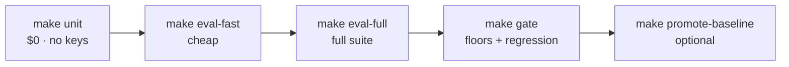
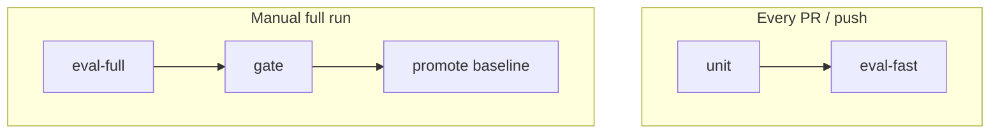

# 7-Day AI QA Onboarding Plan

**Lab:** `ai-compliance-qa-lab` — hands-on practice gym for AI QA engineering  
**Pace:** ~2.5–3 hrs/day (weekdays), ~4 hrs (weekends) · **~20–22 hours total**  
**Tutor skill:** `.cursor/skills/ai-qa-tutor/SKILL.md`  
**Companion:** [`docs/STUDY_GUIDE.md`](STUDY_GUIDE.md) (exercises by module), [`docs/EVAL_STRATEGY.md`](EVAL_STRATEGY.md) (strategy)

---

## Goal

By Day 7 you can:

- Break the RAG/agent system on purpose and predict which test fails
- Diagnose failures using metrics, traces, and golden datasets
- Explain your QA strategy in a 5-minute interview answer
- Run the eval pyramid: `make unit` → `make eval-fast` → `make eval-full` → `make gate`

---

## Daily structure (every day)

| Block | Time | Purpose |
|-------|------|---------|
| **Learn** | 45 min | Read docs + one concept |
| **Do** | 90 min | Hands-on in this repo |
| **Break** | 30 min | Intentionally break something; predict failure |
| **Tell** | 15 min | Explain out loud (record yourself) |

**Ritual:** Run `make unit` before you stop each day.

---

## Schedule overview

| Day | Date | Theme | Detailed guide |
|-----|------|-------|----------------|
| 1 | Tue Jun 16 | RAG foundations + eval pyramid | [`STUDY_GUIDE.md`](STUDY_GUIDE.md) Module 1 |
| 2 | **Wed Jun 17** | **RAGAS + golden datasets** | **[`DAY_02_RAGAS.md`](DAY_02_RAGAS.md)** ← start here today |
| 3 | Thu Jun 18 | G-Eval + custom rubrics | [`STUDY_GUIDE.md`](STUDY_GUIDE.md) Module 2 |
| 4 | Fri Jun 19 | Security + adversarial (OWASP) | Module 3 |
| 5 | Sat Jun 20 | Non-determinism + Langfuse | Modules 4 + 5 |
| 6 | Sun Jun 21 | CI gate + eval tiers | Module 6 |
| 7 | Mon Jun 22 | Agent QA + mock interview | Module 7 + [`AGENT_QA.md`](AGENT_QA.md) |

---

## Day 1 — RAG foundations (prerequisite for Day 2)

**Theme:** What AI QA is in this repo; how RAG is tested.

### Learn
- [`docs/EVAL_STRATEGY.md`](EVAL_STRATEGY.md) — test pyramid, four measurement layers
- [`docs/ARCHITECTURE.md`](ARCHITECTURE.md) — question → retrieve → generate

### Do
- Exercise 1.1: `make ingest`, `make serve`, ask about Article 5, `curl localhost:8000/health`
- Read [`app/rag.py`](../app/rag.py): `SYSTEM_PROMPT`, `retrieve()`, `answer()`
- Skim [`eval/datasets/golden.jsonl`](../eval/datasets/golden.jsonl) — 5 cases

### Tell
> *"How would you test a RAG system?"* → pyramid in `EVAL_STRATEGY.md`

**Pass:** `corpus_chunks > 0`; can draw the pyramid from memory.

---

## Day 2 — RAGAS + golden datasets

**→ Full workbook: [`DAY_02_RAGAS.md`](DAY_02_RAGAS.md)**

**Theme:** Reference-based metrics; golden datasets as the contract between product and QA.

**Pass:** 3 new golden cases; RAGAS run once; explain all 4 metrics + floor vs gate.

---

## Day 3 — G-Eval + custom rubrics

**Theme:** Production QA encodes *your* product rules, not only generic RAGAS.

### Learn
- [`eval/test_deepeval.py`](../eval/test_deepeval.py) — citation + refusal metrics

### Do
- Exercise 2.1–2.2: add `Conciseness` G-Eval
- `pytest eval/test_deepeval.py -v -m eval`
- Agent tab: good vs bad trajectory (lookup vs 5× search)

### Tell
> *"Why not just RAGAS?"* → G-Eval encodes compliance rules.

**Pass:** One custom metric added.

---

## Day 4 — Security + adversarial

**Theme:** Red-team thinking; OWASP LLM Top 10 mapped to tests.

### Learn
- OWASP table in [`EVAL_STRATEGY.md`](EVAL_STRATEGY.md)
- [`tests/test_rag_security.py`](../tests/test_rag_security.py) (LLM08)
- [`eval/test_adversarial.py`](../eval/test_adversarial.py)

### Do
- Run each OWASP-mapped test; add one agent injection string
- Break: remove rule 4 from `SYSTEM_PROMPT`; run security unit test

### Tell
> *"How do you security-test an LLM app?"*

**Pass:** 6+ OWASP categories with repo tests; one new adversarial case.

---

## Day 5 — Non-determinism + observability

**Theme:** Test properties, not exact strings; traces close the debug loop.

### Learn
- [`eval/test_metamorphic.py`](../eval/test_metamorphic.py), [`eval/test_bias.py`](../eval/test_bias.py)
- [`app/observability.py`](../app/observability.py)

### Do
- Langfuse setup; RAG + agent traces
- Debug drill: `k=1` → faithfulness drop → find bad chunks in trace

### Tell (STAR)
> *"Tell me about a regression you found."* — use k=1 debug story.

**Pass:** Langfuse screenshot; can walk retrieve → generate spans.

---

## Day 6 — CI gate + eval tiers

**Theme:** Floors + baseline regression; cost-aware CI.

### Learn
- [`eval/gate.py`](../eval/gate.py), [`eval/conftest.py`](../eval/conftest.py) (caching)

### Do
- Edit `current.json` → `make gate` fails on purpose
- `make eval-fast`; optionally `make eval-full` + `make promote-baseline`

### Tell
> *"What goes in a CI gate?"*

**Pass:** Gate failed on purpose; explain floor vs regression.

---

## Day 7 — Agent QA + mock interview

**Theme:** Path vs destination; synthesis.

### Learn
- [`docs/AGENT_QA.md`](AGENT_QA.md) fully

### Do
- `pytest eval/agent/ -v -m "not slow"`
- Record 5 interview answers (5 min each)
- Capstone: break one thing → narrowest test → postmortem paragraph

### Tell
> *"Correct answer via bad trajectory = regression."*

**Pass:** 5-min recording; capstone postmortem written.

---

## Progress checklist

- [ ] Day 1: `make unit` green; Streamlit RAG works
- [ ] Day 2: 3+ golden cases; RAGAS run once; metrics explained
- [ ] Day 3: 1 custom G-Eval metric
- [ ] Day 4: OWASP table; 1 adversarial case added
- [ ] Day 5: Langfuse trace captured
- [ ] Day 6: Gate failed on purpose; `eval-fast` green
- [ ] Day 7: Interview recording; capstone postmortem

---

## Cost guide

| Command | API cost | When |
|---------|----------|------|
| `make unit` | $0 | Every session |
| `make ingest` | $0 (local embeddings) | After corpus change |
| `pytest eval/test_ragas.py -k anthropic` | ~$0.30–0.80 | Day 2 |
| `make eval-fast` | ~$0.10–0.30 | Day 6 |
| `make eval-full` | ~$1.50–2.50 | Once before baseline promote |

**Keys:** `ANTHROPIC_API_KEY` for RAGAS judge + answer generation. Embeddings are local (`EMBEDDING_PROVIDER=local`).

---

## Cursor tutor commands

While learning, say:

- *"Use ai-qa-tutor skill — quiz me on RAGAS"*
- *"Use ai-qa-tutor skill — mock interview question 2"*
- *"Use repo-maintainer skill"* — when you need CI/fixes, not lessons

---

## After Day 7

Continue with [`STUDY_PLAN.md`](STUDY_PLAN.md) (4-week track) or repeat weak days. Stretch: push to GitHub, green CI, portfolio screenshot.
